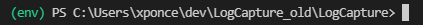

# LogCapture Script
This script is to assist in collecting logs from devices in an efficient and
uniform manner.

## Installation
Installation of the script is straight forward. Begin by cloning the repository
from GitLab to your local machine in the directory of your choosing.

`git clone https://gitlab.network.dataremote.com/lab_testing/LogCapture`

After cloning, you'll want to create a Python virtual environment so as to not
trample over your global Python configuration.

`python -m venv env`

You will then want to "activate" the environment by running the activate script.

**Windows**  
`.\env\Scripts\activate`

**Unix**  
`./env/bin/activate`

You should then see some sort of indicator in your shell when your environment
is active.

After activating the enviroment you'll want to install the required libraries
using the following command.

`pip install -r requirements.txt`

You are now ready to collect logs!

## Running the Script
Refer to the Confluence documentation found
[here](https://dataremote.atlassian.net/wiki/spaces/PIAB/pages/1772879873/Log+Capture+Script+Guide) 
for instructions on running the script.